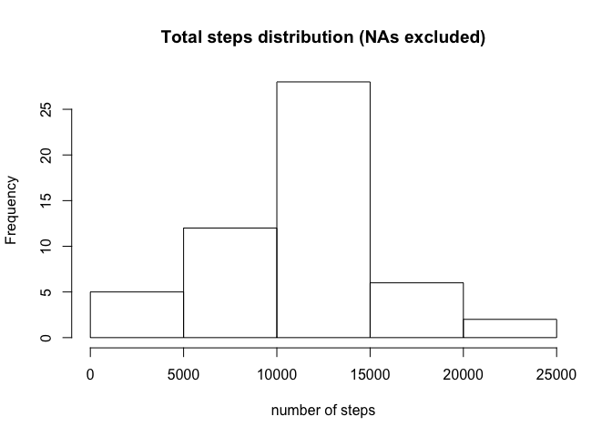

Loading required libraries:

    library(dplyr)
    library(ggplot2)

Loading and preprocessing the data
----------------------------------

Let's load the data and convert string variable "data" to Date format

    activity <- read.csv('activity.csv')
    activity$date<-as.Date(activity$date)
    head(activity)

    ##   steps       date interval
    ## 1    NA 2012-10-01        0
    ## 2    NA 2012-10-01        5
    ## 3    NA 2012-10-01       10
    ## 4    NA 2012-10-01       15
    ## 5    NA 2012-10-01       20
    ## 6    NA 2012-10-01       25

    class(activity[1,2])

    ## [1] "Date"

What is mean total number of steps taken per day?
-------------------------------------------------

Calculate the total number of steps taken per day:

    totalSteps <- summarise(group_by(activity, date), total_steps=sum(steps))
    head(totalSteps)

    ## # A tibble: 6 x 2
    ##         date total_steps
    ##       <date>       <int>
    ## 1 2012-10-01          NA
    ## 2 2012-10-02         126
    ## 3 2012-10-03       11352
    ## 4 2012-10-04       12116
    ## 5 2012-10-05       13294
    ## 6 2012-10-06       15420

Difference between histogram and barplot:

    hist(totalSteps$total_steps, main = "Total steps distribution (NAs excluded)", 
         xlab = "number of steps")

    barplot(totalSteps$total_steps, main = "Total steps for each day")

Calculate and report the mean and median of the total number of steps
taken per day:

    mean(totalSteps$total_steps, na.rm = TRUE)

    ## [1] 10766.19

    median(totalSteps$total_steps, na.rm = TRUE)

    ## [1] 10765

What is the average daily activity pattern?
-------------------------------------------

Time series plot (i.e. 𝚝𝚢𝚙𝚎 = "𝚕") of the 5-minute interval (x-axis) and
the average number of steps taken, averaged across all days (y-axis):

    fiveMinAveraged <- summarise(group_by(activity, interval), avg_steps=mean(steps, na.rm = TRUE))
    plot(fiveMinAveraged$interval, fiveMinAveraged$avg_steps, type='l',
         main = "Number of steps", xlab='5 Min Interval', ylab = 'Number of steps')

Which 5-minute interval, on average across all the days in the dataset,
contains the maximum number of steps?

    fiveMinAveraged[which(fiveMinAveraged$avg_steps == max(fiveMinAveraged$avg_steps)),1]

    ## # A tibble: 1 x 1
    ##   interval
    ##      <int>
    ## 1      835

Imputing missing values
-----------------------

Calculate and report the total number of missing values in the dataset
(i.e. the total number of rows with 𝙽𝙰s)

    sum(is.na(activity$steps))

    ## [1] 2304

Let's replace missing values with average for 5 min interval

    for (i in fiveMinAveraged$interval) {
        activity[is.na(activity$steps) & activity$interval==i, 1] <- 
          fiveMinAveraged[fiveMinAveraged$interval==i,2]  
    }

Make a histogram of the total number of steps taken each day and
Calculate and report the mean and median total number of steps taken per
day.

    totalSteps <- summarise(group_by(activity, date), total_steps=sum(steps))
    hist(totalSteps$total_steps, main = "Total steps distribution (NAs replaced with mean for interval)", 
         xlab = "number of steps")

    mean(totalSteps$total_steps)

    ## [1] 10766.19

    median(totalSteps$total_steps)

    ## [1] 10766.19

As we see, this NA-filling strategy does not impact on average values
significantly

Are there differences in activity patterns between weekdays and weekends?
-------------------------------------------------------------------------

Create a new factor variable in the dataset with two levels – “weekday”
and “weekend” indicating whether a given date is a weekday or weekend
day.

    activity$weekday <- weekdays(activity$date)
    activity$weekday.type <- ifelse(activity$weekday == "суббота" | activity$weekday == 
                                 "воскресенье", "Weekend", "Weekday")
    activity$weekday.type <- factor(activity$weekday.type)

Time series plot (i.e. 𝚝𝚢𝚙𝚎 = "𝚕") of the 5-minute interval (x-axis) and
the average number of steps taken, averaged across all weekday days or
weekend days (y-axis).

    fiveMinWdAvg <- summarise(group_by(activity, interval, weekday.type), total_steps=mean(steps))
    ggplot(fiveMinWdAvg,aes(x=interval, y=total_steps))+geom_line()+facet_grid(~weekday.type)

